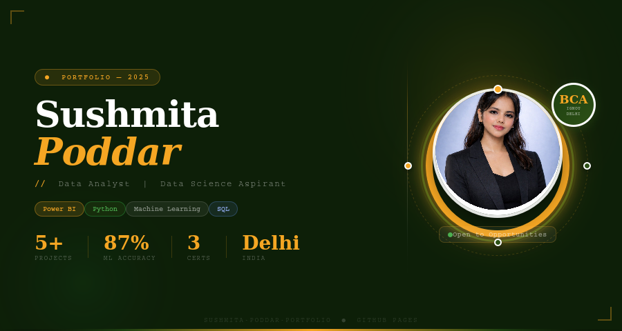

<div align="center">

# 🌟 Sushmita Poddar — Portfolio Website

### Data Analyst | Data Science Aspirant | BCA Graduate — IGNOU, Delhi

🌐 [View Live Portfolio](https://sushmita2000g-glitch.github.io/sushmita-poddar-portfolio) &nbsp;•&nbsp; 💼 [LinkedIn](https://linkedin.com/in/sushmita-poddar-782b523b0) &nbsp;•&nbsp; 📧 [Email](mailto:sushmitapoddar@email.com) &nbsp;•&nbsp; 📞 +91-8882375437

---

## 🖥️ Portfolio Preview



</div>

---

## 👩‍💼 About Me

> *"Turning raw data into intelligent decisions — one insight at a time."*

I'm **Sushmita Poddar**, a BCA Graduate from **IGNOU, Delhi** passionate about Data Analytics, Business Intelligence, and Machine Learning. I build end-to-end data solutions — from cleaning messy datasets to deploying interactive Power BI dashboards and predictive ML models.

- 📍 **Location:** Delhi, India — Open to Remote
- 🎓 **Education:** BCA — IGNOU (2019–2022)
- 💼 **Looking for:** Data Analyst / Data Scientist roles
- 🌐 **Portfolio:** [Live Site →](https://sushmita2000g-glitch.github.io/sushmita-poddar-portfolio)

---

## 🛠️ Built With

| Technology | Purpose |
|:---|:---|
| **HTML5** | Structure & content |
| **CSS3** | Styling, animations, responsive design |
| **JavaScript (Vanilla)** | Interactivity, scroll effects, form handling |
| **Chart.js** | Live interactive dashboards inside project cards |
| **Font Awesome** | Icons throughout the site |
| **GitHub Pages** | Free hosting & deployment |

---

## 📊 My Skills

### 🐍 Programming
`Python` &nbsp; `SQL` &nbsp; `VBA`

### 📊 Data Analysis
`Pandas` &nbsp; `NumPy` &nbsp; `Matplotlib` &nbsp; `Seaborn`

### 🤖 Machine Learning
`Scikit-Learn` &nbsp; `EDA` &nbsp; `Classification` &nbsp; `Regression` &nbsp; `Feature Engineering`

### 📈 BI & Dashboards
`Power BI (AI-Powered)` &nbsp; `Tableau` &nbsp; `Advanced Excel` &nbsp; `DAX`

### 🔧 Automation
`VBA Macros` &nbsp; `200+ Excel Formulas` &nbsp; `Pivot Tables` &nbsp; `AI Workflows`

---

## 📂 Featured Projects

### 1. 📊 Sales Data Analysis Dashboard

| | |
|:--|:--|
| **Problem** | Company sales declining — no visibility into region/product performance |
| **Solution** | AI-powered Power BI dashboard with KPI cards, drill-down filters, trend lines |
| **Tools** | Power BI · SQL · DAX · Excel |
| **Outcome** | ✅ Identified top 3 regions → **12% Q4 improvement** |

---

### 2. 🤖 Customer Churn Prediction

| | |
|:--|:--|
| **Problem** | Telecom company losing customers with no early warning system |
| **Solution** | Random Forest classifier trained on 7,000+ records with cross-validation |
| **Tools** | Python · Scikit-Learn · Pandas · Matplotlib |
| **Outcome** | ✅ **87% prediction accuracy** → 20% projected churn reduction |

---

### 3. 🦠 COVID-19 Data Analysis

| | |
|:--|:--|
| **Problem** | Messy multi-country datasets hiding pandemic spread patterns |
| **Solution** | Data cleaning + time-series plots, heatmaps, rolling averages |
| **Tools** | Python · Pandas · Seaborn · NumPy |
| **Outcome** | ✅ Identified **3 peak surge periods** and high-risk regions |

---

### 4. ⚡ Excel VBA Automation

| | |
|:--|:--|
| **Problem** | Finance team spending 10+ hrs/week compiling 15 Excel sheets manually |
| **Solution** | VBA macros for one-click report generation + auto email dispatch |
| **Tools** | Excel · VBA · Macros |
| **Outcome** | ✅ **70% time reduction** — 10 hrs → under 3 hrs weekly |

---

### 5. 🛒 E-Commerce Product Analysis

| | |
|:--|:--|
| **Problem** | Retailer unable to identify underperforming product categories |
| **Solution** | Cohort analysis + funnel charts on 50,000+ transaction records |
| **Tools** | Python · Pandas · Matplotlib · SQL |
| **Outcome** | ✅ Top 5 categories identified → **15% margin improvement** |

---

## 📋 What's Inside the Portfolio

```
🏠  Hero          →  Circular photo with bold yellow + green rings, floating badges
👩  About         →  Bio, skills, stats counter, CV download button
🛠️  Skills        →  5 animated skill cards with hover effects
📊  Projects      →  5 real projects each with a live Chart.js mini dashboard
🎓  Education     →  BCA IGNOU + Diploma + 3 Certifications
💪  Competencies  →  8 core data skills with icons
❓  FAQ           →  Accordion style Questions & Answers
📬  Contact       →  Branded social links + working contact form
🔻  Footer        →  4-column layout with newsletter signup
```

---

## 🎓 Certifications

| Certificate | Issuer | Date |
|:--|:--|:--|
| ✅ Power BI Workshop | OfficeMaster (Verified) | Feb 22, 2026 |
| ✅ Advanced Excel Workshop | Ira Skills · MSME · ISO 9001:2015 | Feb 08, 2026 |
| ✅ Excel Using AI Workshop | OfficeMaster (Verified) | Feb 22, 2026 |

---

## 🚀 How to Run Locally

```bash
# 1. Clone the repository
git clone https://github.com/sushmita2000g-glitch/sushmita-poddar-portfolio.git

# 2. Go into the folder
cd sushmita-poddar-portfolio

# 3. Open in browser — no build tools needed!
# Windows:
start index.html

# Mac:
open index.html

# Linux:
xdg-open index.html
```

> ✅ **No npm · No build tools · No dependencies** — just open `index.html`!

---

## 📁 Repository Structure

```
sushmita-poddar-portfolio/
│
├── 📄 index.html     ← Complete portfolio (HTML + CSS + JS all-in-one)
├── 🖼️  preview.png    ← Portfolio preview image (shown above)
└── 📋 README.md      ← This file
```

---

## 🔗 My GitHub Projects

- 🔗 [Data Analysis with Matplotlib & Seaborn](https://github.com/sushmita2000g-glitch/data-analysis-matplotlib-seaborn)

---

## 📬 Connect With Me

| Platform | Link |
|:--|:--|
| 💼 **LinkedIn** | [sushmita-poddar-782b523b0](https://linkedin.com/in/sushmita-poddar-782b523b0) |
| 🐙 **GitHub** | [sushmita2000g-glitch](https://github.com/sushmita2000g-glitch) |
| 📧 **Email** | sushmitapoddar@email.com |
| 📱 **Phone** | +91-8882375437 |
| 💬 **WhatsApp** | [Chat on WhatsApp](https://wa.me/918882375437) |
| 📍 **Location** | Delhi, India · Open to Remote |

---

## 📄 License

```
MIT License — Free to use, share, and modify with attribution.
© 2025 Sushmita Poddar
```

---

<div align="center">

### ⭐ If you like this project, please give it a Star! ⭐

**Made with ❤️ by Sushmita Poddar · Delhi, India · 2025**

</div>
